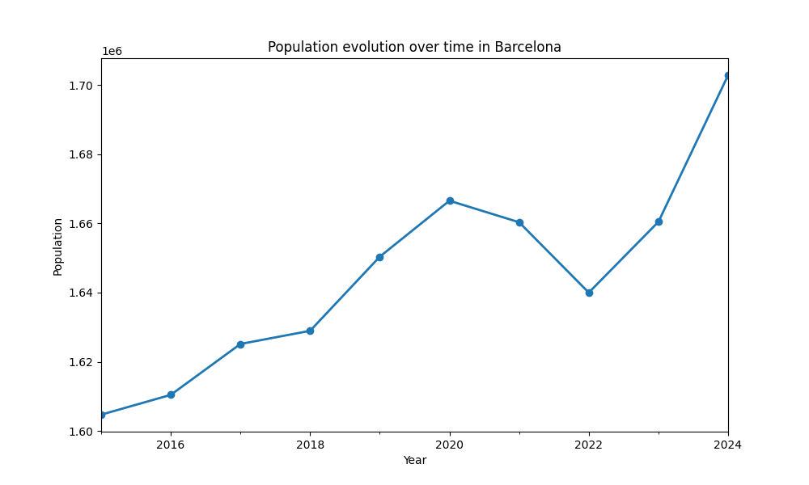
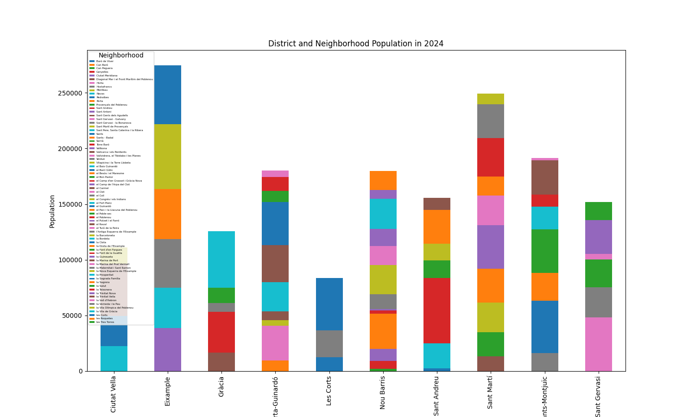
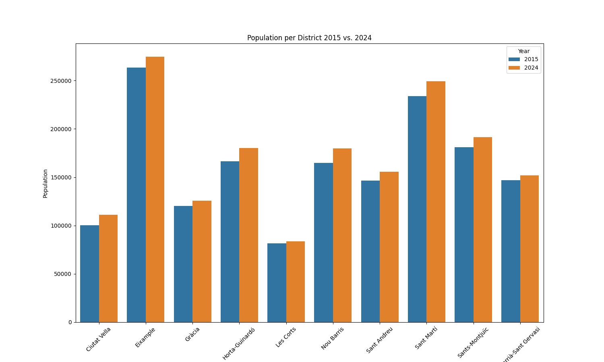
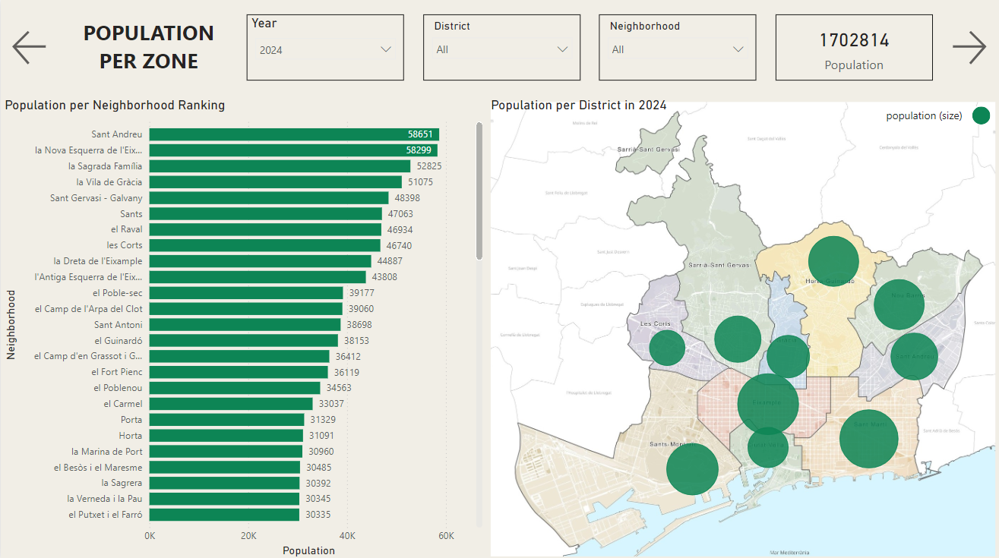
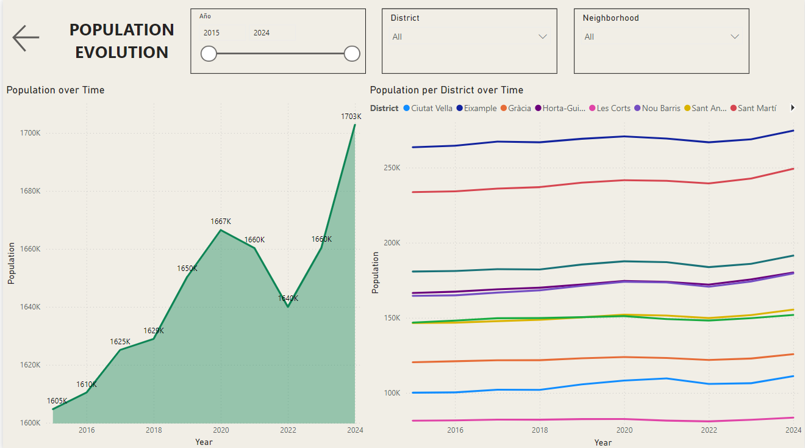

# Barcelona Population Analysis


### A Python and Power BI Project about the evolution of population in Barcelona and its Neighborhoods

These recent years people is leaving small towns to settle in big cities, that usually offers more opportunities and comfortability. There's even been many news talking about small towns offering free houses to new villagers in order to be more competitive. But how much has the population of cities really grown over the last years? This project tries to give an answer to this question, focused on a city to wich I belong nowadays, Barcelona. We'll try to answer using official City Hall data, and using all the steps in a typical Data Analytics project:

* Question Formulation
* Data Acquisition
* Data Cleaning and Management
* Data Analysis
* Dashboard and Insights

We'll see in more detail these 5 parts in a minute.


## Project Structure

The Project Structure goes as follows:

population_analysis_python_powerbi/
├── analysis_results/
│ ├── 2024-2015_population_comparison_per_district.png
│ ├── 2024-2015_population_ratio_per_district.png
│ ├── district_neighborhood_population_2024.png
│ ├── district_population_2024.png
│ ├── neighborhood_population_2024.png
│ ├── population_growth.png
│ ├── population_growth_per_district.png
├── data_cleaning/
│ ├── cleaned_population_data.csv
├── sources/
│ ├── 2015_pad_mdbas.csv
│ ├── 2016_pad_mdbas.csv
│ ├── 2017_pad_mdbas.csv
│ ├── 2018_pad_mdbas.csv
│ ├── 2019_pad_mdbas.csv
│ ├── 2020_pad_mdbas.csv
│ ├── 2021_pad_mdbas.csv
│ ├── 2022_pad_mdbas.csv
│ ├── 2023_pad_mdbas.csv
│ ├── 2024_pad_mdbas.csv
├── dashboard_images/
│ ├── barcelona_district_map.jpg
│ ├── dashboard_cover.jpg
├── main.py
├── population_dashboard.pbix
├── README.md
├── requirements.txt


## Steps of the project

As mentioned before, we defined steps to get the results we want from this project. Let's classify the project by those steps:

### Question Formulation

In this case, the question is pretty clear: How much has the population of Barcelona grown over the last years? 

Having this question, we can proceed with the following step

### Data Acquisition

There is two main priorities when getting the data: 

- Getting Data that solve our question.
- Getting data that we can rely on.

Fortunately, for this project I found official data from the Barcelona City Hall, called [Opened Data BCN](https://opendata-ajuntament.barcelona.cat/en/), and more specifically, [data about population](https://opendata-ajuntament.barcelona.cat/data/en/dataset/pad_mdbas), where there are many documents, each of them representig a year of records. This records are made the first day of the year, so in order to have many different dates, I'll take the years between 2015 and 2024.

In this part, we just need to add all the files containing data in a single file, that will be cleaned to be analysed after. This part is done in the "main.py" file.

### Data Cleaning and Management

After grouping all the Data, we look for NULLS, duplicates and issues on Data. Even there's no NULL Data or duplicate rows, in the main.py file I called for eliminating these kind of rows, in case new data is added in the future.

What had been changed is the column names, that i Translated to English (was initially in catalan).

Apart from that, I changed data types, more specifically, for the Date column, converting it from a string to Date type.

### Data Analysis

You can see all the results of my Data in the analysis_results directory. As we can see there, there's an evolution in every District of Barcelona, and there's even an analysis on Districts that have grown the most between 2015 and 2024.

You can see here some of the most interesting analysis made on this step:

Population Growth in Barcelona over the last 10 years


2024 distribution of population per District and Neighborhood


2015 - 2024 population comparison per District in Barcelona



### Dashboard and Insights

Finally, with all the information we've acquired, I've made a Power BI report, in order to better show the insights taken. For this purpose, I created two new columns, representing the position of the districts, so we can easily distinguish the districts with more population. Here we have two pictures of what we can see in the dashboard:






## Requirements

Get sure to have the following libraries properly installed:

- pandas
- matplotlib
- seaborn

In case you don't, you can do it by using the following code:

```bash
pip install -r requirements.txt
```


## How to install and execute the project

- Clone the repository with the following command:

git clone <url_del_repositorio>

- Go to the project directory:

cd population_analysis_python_powerbi

- Install the dependencies:

pip install -r requirements.txt

- Execute main.py:

python main.py


This will execute the project. Then you can go to the Power BI dashboard attached to the project. 


I hope you enjoy the project!